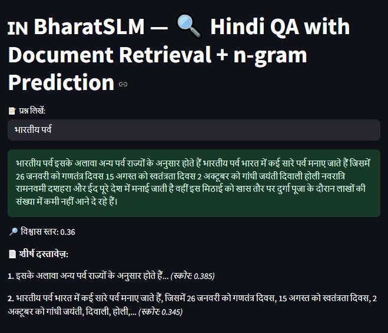

# 🇮🇳 BharatSLM — Hindi QA with Document Retrieval + n-gram Prediction

### 🔍 Overview

**BharatSLM** is a lightweight **Hindi Question-Answering (QA)** system that combines:

* **TF-IDF / semantic retrieval**, and
* **n-gram–based Hindi language modeling**

to generate short, contextually relevant answers **without depending on large cloud-based GPT models**.

It is built entirely with open-source classical NLP tools (NLTK, scikit-learn, Streamlit) and runs locally, making it ideal for **low-resource, offline, or domain-specific** Hindi applications.

---

## 📁 Directory Structure

```
bharatslm/
│
├── data/
│   └── india.txt                   # Hindi text corpus (e.g., Wikipedia or custom)
│
├── models/
│   ├── 2gram.pkl                   # Saved bigram model
│   ├── 3gram.pkl                   # Saved trigram model
│   └── 4gram.pkl                   # Saved 4-gram model
│
├── slm_utils.py                    # N-gram model class & cleaning helpers
├── retrieval.py                    # TF-IDF retriever using cosine similarity
├── train_models.py                 # Train and pickle n-gram models
├── predict.py                      # Text generation utilities
├── app.py                          # Streamlit web interface
│
├── requirements.txt                # Dependencies
└── README.md                       # This file
```

---

## ⚙️ Architecture Diagram

```text
               ┌──────────────────────────┐
               │        User Input        │
               │   (Hindi Question Text)  │
               └────────────┬─────────────┘
                            │
                            ▼
             ┌──────────────────────────┐
             │      Document Search     │
             │ (TF-IDF / Semantic Match)│
             └────────────┬─────────────┘
                            │
                Retrieved top relevant
                     Hindi texts
                            │
                            ▼
          ┌────────────────────────────────┐
          │       Context Preparation      │
          │ (Combine question + snippets)  │
          └────────────────┬───────────────┘
                            │
                            ▼
             ┌──────────────────────────┐
             │   N-gram Text Generator  │
             │ (Predict next Hindi word │
             │   using 2/3/4-gram freq) │
             └────────────┬─────────────┘
                            │
                            ▼
               ┌────────────────────────┐
               │  Final Hindi Sentence  │
               │   (Answer Generation)  │
               └────────────────────────┘
```

🧩 **Pipeline summary:**

1. User enters a Hindi question.
2. Retriever finds top-matching sentences from your corpus.
3. The generator expands that context word-by-word using the n-gram model.
4. The final sentence is cleaned, punctuated, and shown as the answer.

---

## 🧠 Why Use BharatSLM Instead of GPT Models?

| Factor                   | BharatSLM                       | GPT-based Models             |
| :----------------------- | :------------------------------ | :--------------------------- |
| **Deployment**           | Runs offline on CPU             | Needs internet or paid API   |
| **Data Privacy**         | 100% local                      | Sends text to remote servers |
| **Language Focus**       | Optimized for Hindi text        | Multilingual but general     |
| **Customization**        | Easily trainable on your corpus | Costly fine-tuning needed    |
| **Compute Requirements** | Lightweight                     | Heavy GPU/cloud              |
| **Explainability**       | Transparent probabilities       | Black-box deep model         |

💡 *BharatSLM is ideal for offline QA systems, schools, local government use, and research environments focused on Hindi NLP.*

---

## 🚀 Features

✅ **Offline Hindi QA:** Works without internet or cloud access.
✅ **Retrieval + Generation:** Combines classical IR with statistical text generation.
✅ **Compact Models:** Lightweight `.pkl` files (few MBs).
✅ **Custom Corpora:** Drop any `.txt` files in `/data/` to train your own assistant.
✅ **Streamlit UI:** Clean, bilingual-ready web interface.

---

## 🧩 Installation

```bash
git clone https://github.com/yourusername/bharatslm.git
cd bharatslm
pip install -r requirements.txt
```

---

## 🧩 Usage

### 1️⃣ Train the n-gram models

```bash
python train_models.py
```

### 2️⃣ Run the Streamlit app

```bash
streamlit run app.py
```

### 3️⃣ Ask a question in Hindi

Type something like:

> भारत के प्रमुख पर्व कौन-से हैं?

BharatSLM will:

* Retrieve related sentences about Indian festivals,
* Generate a concise Hindi answer, and
* Display confidence and top supporting documents.

---

## 🧾 Example Output



---

## ⚖️ Advantages and Disadvantages

### ✅ Advantages

* Fully offline — no data privacy concerns.
* Transparent and explainable predictions.
* Fast and resource-efficient (CPU-friendly).
* Works on any Hindi dataset (Wikipedia, news, books).
* Easy to retrain and extend.

### ⚠️ Disadvantages

* Limited fluency and context depth compared to GPTs.
* Cannot generalize to topics not seen in corpus.
* Answer length and diversity are restricted by n-gram order.
* Basic retrieval (TF-IDF) lacks deep semantic understanding.

---

## 🧭 Future Directions

* 🔹 Integrate **Sentence Transformers** for semantic retrieval.
* 🔹 Replace n-gram generator with **Indic-GPT** or similar transformer.
* 🔹 Add user feedback + scoring system.
* 🔹 Expand corpus for coverage across Hindi culture, history, science, etc.
* 🔹 Deploy on **Streamlit Cloud / Hugging Face Spaces**.

---

## 👥 Credits

* **Developed under the BharatSLM Project** — promoting open-source, low-resource Hindi NLP.
* Built using: `NLTK`, `scikit-learn`, `Streamlit`, and open Hindi corpora (e.g., Hindi Wikipedia).

---

